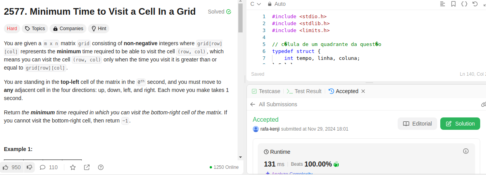
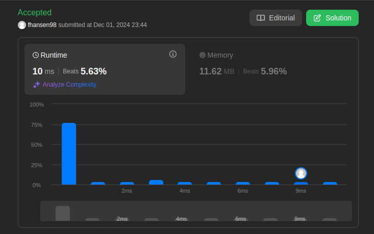

# LeetCode_Questoes

**Número da Lista**: 42 
**Conteúdo da Disciplina**: Grafos2 

## Alunos
|Matrícula | Aluno |
| -- | -- |
| 19/0044128  |  Rafael Kenji Taira |
| 22/2032810  |  Felipe Aguiar Hansen |

## Sobre 

Este projeto consiste em quatro códigos desenvolvidos para resolver questões específicas de grafos da plataforma LeetCode. O objetivo é oferecer soluções para problemas de média e alta dificuldade em grafos, passando por problemas como encontrar o menor caminho, detectar ciclos e calcular a conectividade de nós. Cada código utiliza a linguagem C para resolver o problema específico, aproveitando estruturas de dados otimizadas para garantir desempenho e clareza.

**Problemas**
|Código | Título | Dificuldade |
| -- | -- | -- |
| [2577](https://leetcode.com/problems/minimum-time-to-visit-a-cell-in-a-grid/description/) | Minimum Time To Visit a Cell in a Grid | Difícil |
| [64](https://leetcode.com/problems/minimum-path-sum/description/) | Minimum Path Sum | Médio |

## Screenshots
- Questão 2577

- Questão 64

## Uso 
**Linguagem**: C 
Para verificar as resoluções das questões, copie a resolução da questão desejada que está dentro de sua respectiva pasta e cole na página de exercício do leetcode que tenha a questão ou no código na seção dos problemas apresentados anteriormente

## Video